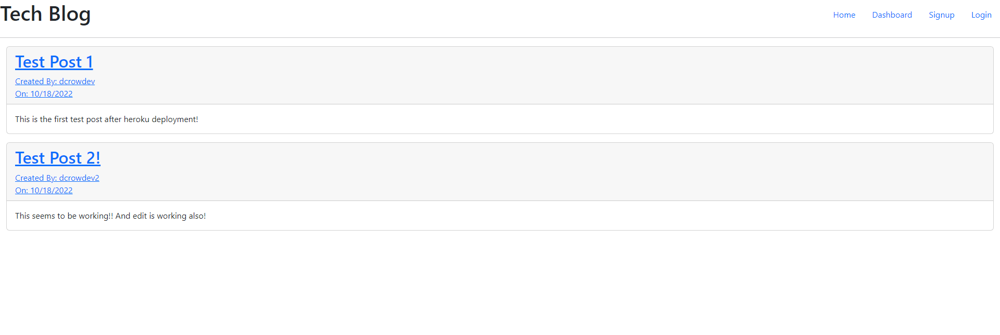

# MVC TECH BLOG

This application is a blog posting site. It implements a functional relational  
database and uses the MVC paradigm and CRUD methods.

[Link to deployed heroku app](https://powerful-stream-89344.herokuapp.com/)

## Description

This is a tech blog posting site! Users can create an account, create their own posts,  
edit their posts and comment on other users posts!

### Installing

No installation necessary for users. Contributors can 'npm i', and 'npm run seed'  
once pulled locally.

### Executing program

For users, click 'signup' on the homepage to make a new user. Once logged in, visit  
'dashboard' to create a post, or click on an individual post to comment on it.  
For contributors, install dependencies and seeds, and either run 'npm start',  
to run the server, or use nodemon.

### Testing

No testing currently available.

## Authors

Dylan Crowley:

[Github](https://github.com/dcrowdev)  
[Twitter](https://twitter.com/dcrowdev)  
[LinkedIn](https://www.linkedin.com/in/dylan-crowley-3974b8252/)  
dcrowdev1025@gmail.com

## License

This project is licensed under the MIT license.

## Acknowledgments

UCF Fullstack bootcamp!
